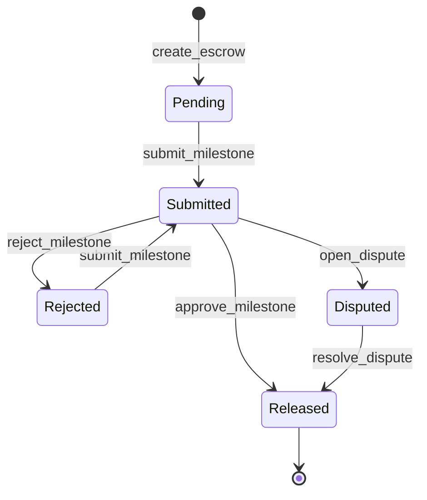
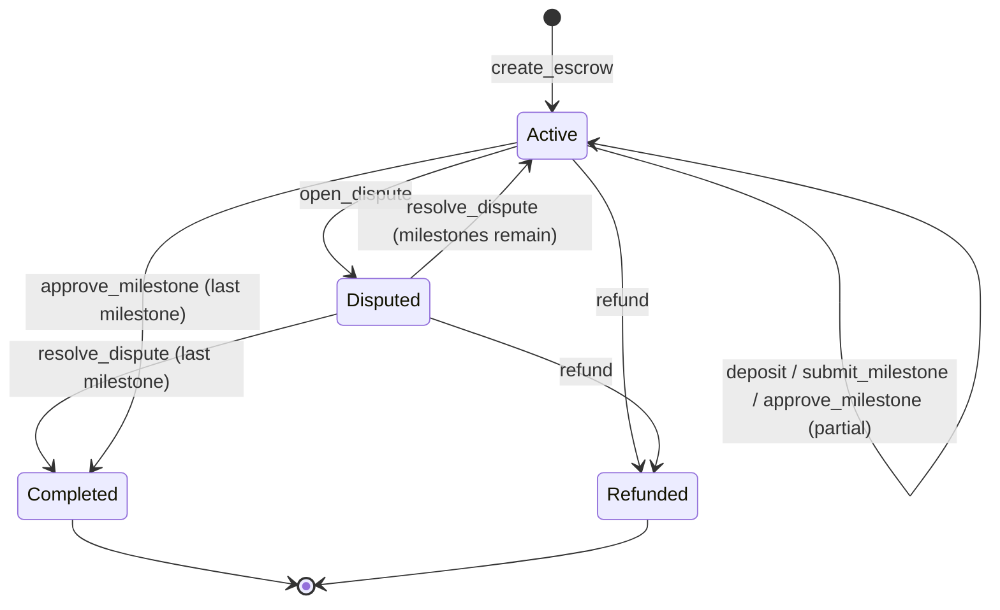

# EscrowFlow

A decentralized escrow contract for freelance payments on [Stellar](https://stellar.org), built with [Soroban](https://developers.stellar.org/docs/build/smart-contracts/overview). EscrowFlow lets a client fund a milestone-based engagement in USDC (or any Stellar Asset Contract token), lets the freelancer submit work milestone-by-milestone, and gives an independent arbitrator the power to resolve disputes — all enforced on-chain, with no custodian holding funds outside the contract itself.

## Why

Freelance platforms typically hold funds in a centralized ledger and take the platform's word for when payment is due. EscrowFlow moves that logic on-chain:

- Funds sit in the contract, not with a company.
- Release requires the client's explicit approval (or an arbitrator's ruling), enforced by Soroban's authorization framework — not an internal database flag.
- Every state transition emits an event, so off-chain UIs and indexers can reconstruct history without trusting a backend.

## Contract logic

### Roles

| Role | Set when | Powers |
|---|---|---|
| **Admin** | `initialize` | Receives the platform fee on every release; can force-refund an escrow's unreleased balance at any time. |
| **Arbitrator** | `initialize` | Sole signer able to resolve an open dispute. |
| **Client** | `create_escrow` | Funds the escrow; approves or rejects submitted milestones; can open a dispute. |
| **Freelancer** | `create_escrow` | Submits milestones as work is completed; can open a dispute. |

### Data model

- **`Escrow`** — the agreement: client, freelancer, token, `total_amount`, `deposited_amount`, `released_amount`, `status`, `milestone_count`, `created_at`.
- **`Milestone`** — one unit of work: `id`, `description`, `amount`, `due_date`, `status`. Stored per-escrow, keyed by `(escrow_id, milestone_id)`.
- **`Dispute`** — one dispute on a specific milestone: who initiated it, the arbitrator on record, and its resolution (`resolved: bool` + `outcome`, populated once resolved — see note below).

> **Why `resolved: bool` + `outcome` instead of `Option<DisputeOutcome>`:** soroban-sdk's `#[contracttype]` derive only generates a *fallible* XDR conversion for custom enums, while `Option<T>` requires an *infallible* one for the SDK's testutils/arbitrary tooling. Wrapping a custom enum in `Option` compiles fine for a release build but fails under `cargo test`. Using an explicit `resolved` flag alongside a plain (non-optional) `outcome` field sidesteps the limitation without changing the contract's externally observable behavior.

### Public functions

| Function | Caller | Effect |
|---|---|---|
| `initialize(admin, arbitrator, platform_fee_bps?)` | admin | One-time setup. Fee defaults to 300 bps (3%). |
| `create_escrow(client, freelancer, token, descriptions, amounts, due_dates)` | client | Creates the escrow and its milestones (all `Pending`). Returns `escrow_id`. |
| `deposit(escrow_id, from)` | `from` | Transfers `total_amount` into the contract. Once per escrow. |
| `submit_milestone(escrow_id, milestone_id, freelancer)` | freelancer | `Pending`/`Rejected` → `Submitted`. Requires the escrow to be fully funded. |
| `approve_milestone(escrow_id, milestone_id, client)` | client | `Submitted` → `Released`; pays the freelancer (minus fee) and the admin (the fee). Completes the escrow once every milestone is released. |
| `reject_milestone(escrow_id, milestone_id, client)` | client | `Submitted` → `Rejected`. |
| `open_dispute(escrow_id, milestone_id, initiator)` | client or freelancer | `Submitted` → `Disputed` (milestone and escrow both); freezes the escrow. |
| `resolve_dispute(escrow_id, milestone_id, outcome, split_bps?)` | arbitrator | Pays out per `outcome`, marks the milestone `Released`, unfreezes the escrow (or completes it). |
| `refund(escrow_id)` | admin | Force-refunds the unreleased balance to the client. |
| `get_escrow(escrow_id)` / `get_milestone(escrow_id, milestone_id)` / `get_dispute(escrow_id, milestone_id)` | anyone | Read-only lookups. |

Every state-changing function calls `.require_auth()` on the relevant party before touching storage. Amounts are `i128`, following the Stellar convention of 7 decimal places (e.g. `100_0000000` = 100.0 USDC).

### Milestone state machine



### Escrow state machine



### Events

`escrow_created`, `funds_deposited`, `milestone_submitted`, `milestone_approved`, `milestone_rejected`, `funds_released`, `dispute_opened`, `dispute_resolved`, `escrow_refunded`.

## Project structure

```
contracts/
├── escrow/            # The EscrowFlow contract
│   ├── src/
│   │   ├── lib.rs      # Contract entry point + all public functions
│   │   ├── types.rs    # Escrow / Milestone / Dispute data types
│   │   ├── storage.rs  # Storage keys + TTL bumping
│   │   ├── errors.rs   # Error enum
│   │   ├── events.rs   # Event publishers
│   │   └── test.rs     # Unit tests
│   └── Cargo.toml
├── test-utils/         # Shared test helpers (mock USDC token, test parties)
│   ├── src/lib.rs
│   └── Cargo.toml
Cargo.toml              # Workspace root
Makefile
```

## Setup

### Prerequisites

- [Rust](https://rustup.rs/) (stable) with the `wasm32-unknown-unknown` target:

  ```sh
  rustup target add wasm32-unknown-unknown
  ```

- [Stellar CLI](https://developers.stellar.org/docs/tools/cli/stellar-cli) (for deploying/invoking on testnet):

  ```sh
  cargo install stellar-cli
  ```

> **Note on rustc versions:** `soroban-sdk` 21.7.4 predates rustc's default enablement of the `reference-types` and `multivalue` wasm target features (rustc ~1.82+). The Makefile's `build`/`build-opt`/`deploy-testnet` targets already export `RUSTFLAGS=-C target-feature=-reference-types,-multivalue` to disable them; you don't need to set this yourself. If you invoke `cargo build --target wasm32-unknown-unknown` directly instead of via `make`, set that env var first.

### Build, test, deploy

```sh
make build           # compile the contract to wasm32-unknown-unknown (release)
make build-opt        # ...then run it through `stellar contract optimize`
make test             # run the workspace test suite
make fmt / fmt-check   # format / check formatting
make lint              # cargo clippy, warnings denied
make clean             # cargo clean

# Deploy the optimized wasm to testnet (requires a funded testnet identity
# named SOURCE_ACCOUNT, default "default"; see `stellar keys generate`):
make deploy-testnet SOURCE_ACCOUNT=alice
```

`deploy-testnet` accepts `NETWORK` (default `testnet`) and `SOURCE_ACCOUNT` (default `default`) as overridable variables, e.g. `make deploy-testnet NETWORK=futurenet SOURCE_ACCOUNT=alice`.

## Testing

The test suite (`contracts/escrow/src/test.rs`) uses `test-utils` to spin up a mock USDC token (a Stellar Asset Contract via `register_stellar_asset_contract_v2`) and a standard set of test parties (client, freelancer, admin, arbitrator), then exercises:

- the full lifecycle — create → deposit → submit → approve every milestone → escrow completes;
- rejection and resubmission of a milestone;
- disputes resolved by release-to-freelancer, refund-to-client, and split;
- authorization and state-machine guards (wrong caller, wrong status, double-deposit, double-resolve, etc).

Run with `make test` or `cargo test --workspace`.
